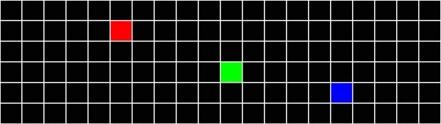
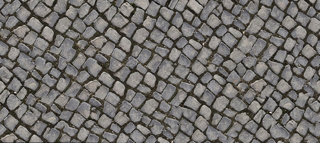

# Polar-Texture-Map

A basic polar to sphere conversion distortion script.

When projection is happen, the distorted image will reform a sphere image with minimum of distortion.

Thanks to references:

1) https://richardrosenman.com/shop/spherical-mapping-corrector/
2) https://www.thebest3d.com/dogwaffle/lua/polar/index.html

| Source | Result |
| - | - |
|  |  |
|  |  |

